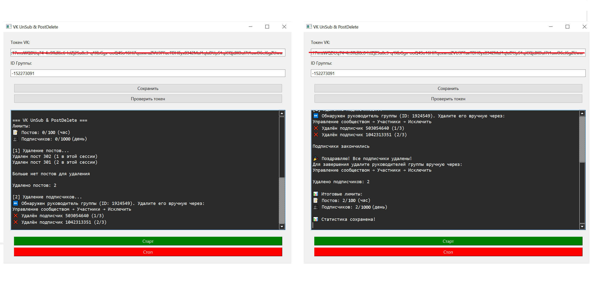
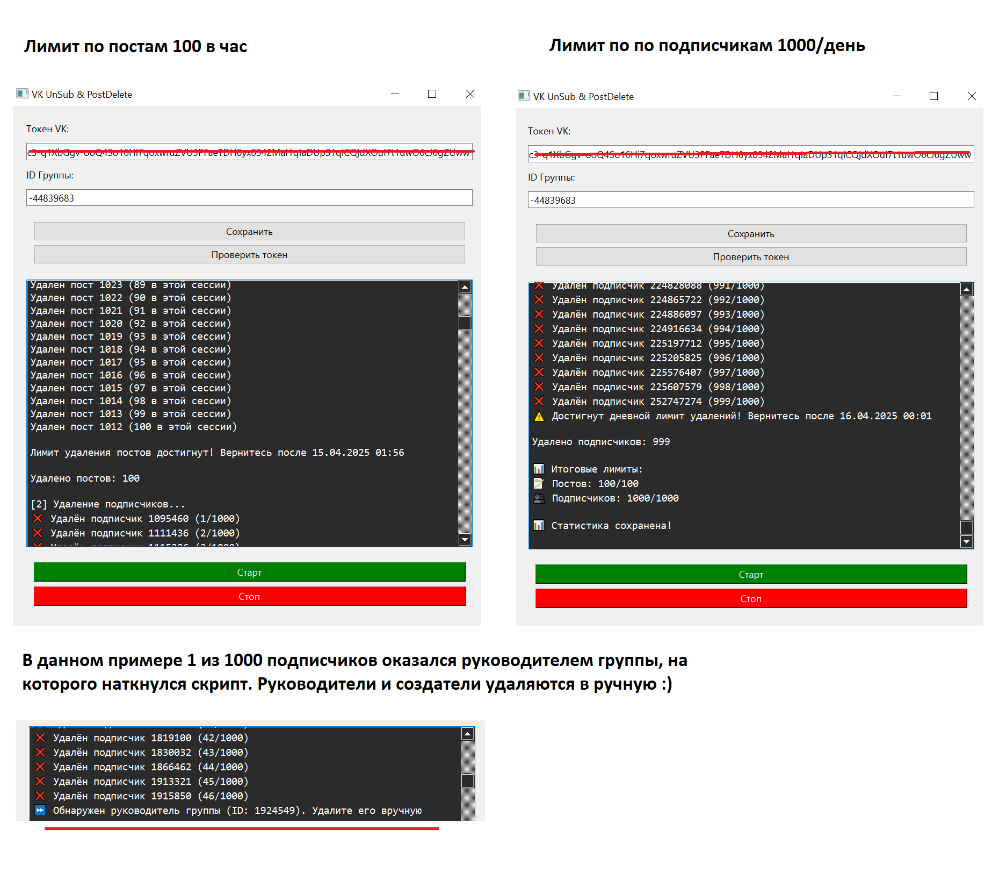

### 🧹 VK UnSub & PostDelete | Удаление постов и отписка подписчиков из групп и сообществ

## Для чего нужен данный проект
Раньше я активно вела несколько торговых сообществ ВК, но после смены деятельности столкнулась с проблемой: группы нельзя просто взять и удалить. Нужно:  
• Очистить все посты (иногда тысячи!)  
• Удалить подписчиков (800, 3000 участников и т.д в каждой группе)
• Удалить медиафайлы  

Вручную — это месяцы работы. Платными сервисами я не хотела пользоваться. Поэтому я создала данный проект и успешно очистила и удалила свои группы ВКонтакте. 

## 🌟 Возможности

- 🗑️ Массовое удаление постов со стены сообщества (100 в час)
- 👥 Удаление подписчиков (до 1000 в день)
- ⏱️ Настраиваемые интервалы между запросами
- 🔒 Безопасное хранение токена в конфигурации
- 🖥️ Удобный графический интерфейс

## ⚙️Технологический стек

- **Python 3.10+** (базовый язык)
- **PyQt6** (графический интерфейс)
- **VK API** (взаимодействие с ВКонтакте)
- **Requests** (HTTP-запросы к API)
- **JSON** (хранение конфигурации и логов)
- **PyInstaller** (сборка в исполняемый файл)

## 🛠️ Установка и запуск

### Требования:
- Python 3.10+
- Активный токен VK

**1. Клонировать репозиторий:**  
```bash
git clone https://github.com/Lisica050521/Python-VK-UnSub-PostDelete.git
cd vk-cleaner
```

**2. Установить зависимости**
```bash
pip install -r requirements.txt
```

**3. Сборка в EXE**
```bash
pyinstaller --onefile --windowed --name "VK UnSub & PostDelete" --icon="favicon.ico" gui.py
```
Готовый файл будет в папке `dist/`.

## 🚀 Инструкция по использованию

**1. Введите токен**  
Пример формата:
```
vk1.a.7hR5sD9kL2pX3wE1qC8zY4xU6vB0nM9jH5gT3fK8dS2lP4rA9wQ5eJ7iV1oN6mZ9cX2yU4bR0tD5fG8hS3jK6lL9pO4aQ7wE2iI5uY0
   ```


**2. Введите ID группы**  
   Пример:
   ```
   152273091
   ```
   
   → Нажмите кнопку **«Сохранить»**  
   → Нажмите **«Старт»** для запуска очистки

**3. Управление процессом**  
   🟢 **Старт** - начало очистки  
   🔴 **Стоп** - принудительная остановка

## 🔐 Как получить токен
1. Перейдите по ссылке:
```
https://oauth.vk.com/authorize?client_id=6121396&scope=groups,wall,manage&response_type=token
```
2. Скопируйте токен из адресной строки (часть после `access_token=` до `&expires_in`)

## 📌 Как найти ID группы
1. Откройте любое фото группы
2. В URL найдите `photo-152273091_...` → ID группы: `-152273091`


## 📌 Как отозвать токен ВКонтакте (2024)
Через завершение всех сеансов:  
Зайдите в Настройки ВК → Управление аккаунтом → Безопасность  → 
Список устройств и история активности → выйти на других устройствах.  
В истории активности → «Завершить все сеансы» 

Все токены (включая ваш) будут аннулированы!

## ⚙️ Конфигурация
Настройки хранятся в `config.json`:
```json
{
  "ACCESS_TOKEN": "ваш_токен",
  "GROUP_ID": "ID_группы",
  "VERSION": "5.131",
  "MAX_USERS_PER_DAY": 1000,
  "MAX_POSTS_PER_HOUR": 100,
  "DELAY": 2
}
```

## 🖼️ Интерфейс


## 🖼️ Работа с лимитами наглядно


## ⚠️ Ограничения
- Не более 1000 подписчиков в день
- Не более 100 постов в час
- Рекомендуемая задержка: 2+ секунды

## Расширю функционал: @lisica_2023